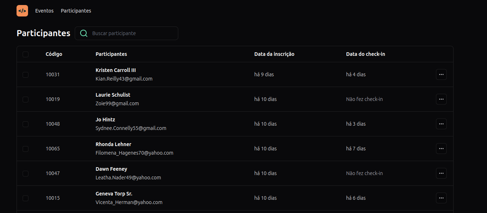

<h1 align="center">
    
</h1>

## 💻 Sobre a aplicação
Aplicação de lista de participantes de evento, listando os dados vindo da API desenvolvida em Node ,
 durante o evento NLW Unite da Rocketseat.

## 🛠 Tecnologias

As seguintes ferramentas foram usadas na construção do projeto:

- React
- TypeScript
- Tailwind
- State API
- Query Params